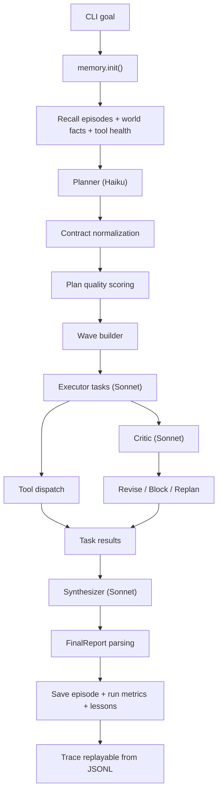

# PHANTOM Engineering Reference

This document describes how the current PHANTOM codebase works at the implementation level.
It is written for engineering review, not for product marketing.

The repository implements a local-first agent runtime with:

- a planner/executor/critic/synthesizer orchestration loop
- human demonstration memory with screenshot asset capture
- scoped persistent memory in SQLite
- built-in tools plus self-generated skills
- a policy layer for shell, file, web, and skill execution
- replayable JSONL traces
- offline engineering evals and unit tests

The descriptions below match the code in the repository as it exists now.

## 1. Repository Layout

| Path | Responsibility |
| --- | --- |
| `phantom.py` | Main CLI, rich console rendering, admin subcommands |
| `phantom_cli.py` | Packaging entrypoint that loads `phantom.py` dynamically |
| `core/contracts.py` | Runtime contracts, parsing helpers, metrics, plan-quality heuristics |
| `core/errors.py` | Shared runtime exception types |
| `core/router.py` | Model constants and simple routing helpers |
| `core/providers.py` | LLM provider abstraction and Anthropic adapter |
| `core/settings.py` | Environment/config parsing, secret loading, redaction |
| `core/loop.py` | Shared agent loop for planner/executor/critic/synthesizer |
| `core/souls.py` | Named soul identities and first-person prompt preludes |
| `core/orchestrator.py` | End-to-end run coordination, wave scheduling, replanning |
| `core/observability.py` | JSONL trace recording and replay |
| `core/extensions.py` | Extension manifest discovery and capability registry |
| `integrations/messaging.py` | Telegram/WhatsApp webhook parsing, async workers, outbound replies |
| `memory/__init__.py` | SQLite-backed scoped memory and skill registry |
| `tools/__init__.py` | Built-in tool schemas and dispatch implementations |
| `tools/browser_runtime.py` | Optional Playwright-backed browser workflow runtime |
| `tools/safety.py` | Safety policy, path controls, shell validation, skill AST validation |
| `tools/skill_runner.py` | Isolated subprocess runtime for generated skills |
| `evals/offline.py` | Deterministic offline engineering eval suite |
| `tests/` | Unit tests for contracts, budgets, memory, safety, observability, orchestration |

## 2. Runtime Dependencies and Packaging

Packaging is defined in `pyproject.toml`.

- Python requirement: `>=3.11`
- Runtime dependencies:
  - `anthropic`
  - `openai`
  - `playwright`
  - `rich`
- Installed console script:
  - `phantom -> phantom_cli:main`

`phantom_cli.py` exists so `pip install -e .` exposes a stable console entrypoint while still running the logic from `phantom.py`.

## 3. High-Level Runtime Architecture



## 4. Boot Sequence and CLI Behavior

`phantom.py` is the primary entrypoint.

Startup behavior:

1. Parse CLI flags.
2. Translate selected flags into `PHANTOM_*` environment variables.
3. Execute one of the admin commands or a full orchestration run.

Supported CLI modes:

| Mode | Effect |
| --- | --- |
| `python phantom.py "goal"` | Full orchestration run |
| `--no-parallel` | Force serial execution |
| `--memory` | Inspect scoped memory |
| `--demonstrations` | Inspect saved human demonstrations |
| `--match-demonstrations QUERY` | Show demonstration matches with confidence |
| `--explain-demonstration ID` | Show one demonstration in full detail |
| `--replay-demonstration ID` | Dry-run or execute replayable steps from one demonstration |
| `--teach-browser-*` | Add executable browser workflow steps to a demonstration |
| `--skills` | Inspect current skill registry |
| `--extensions` | Inspect discovered extension manifests |
| `--skill-history NAME` | Show saved versions for one skill |
| `--rollback-skill NAME VERSION` | Roll back a skill directly through memory API |
| `--teach GOAL` | Save a human demonstration with steps and screenshots |
| `--correct-demonstration ID` | Create a corrected successor for an existing demonstration |
| `--replay TRACE_ID` | Replay a stored JSONL trace |
| `--evals` | Run deterministic offline eval suite |
| `--onboard` | Guided setup for workspace, provider env, and messaging policy |
| `--serve-messaging` | Start webhook server for Telegram and WhatsApp |
| `--set-telegram-webhook URL` | Register Telegram webhook with Bot API |

Important implementation note:

- `--rollback-skill` in the CLI calls `memory.rollback_skill()` directly.
- It does not route through the `rollback_skill` tool.
- That means the CLI admin command bypasses tool-level human checkpoint prompts.
- `--serve-messaging` starts a `ThreadingHTTPServer` and keeps the process alive until interrupted.

## 5. Configuration Surface

Configuration is resolved from environment variables in `core/settings.py`.

### 5.1 Roots and Scope

| Variable | Default | Meaning |
| --- | --- | --- |
| `PHANTOM_WORKSPACE` | `os.getcwd()` | Workspace root for tool path safety |
| `PHANTOM_HOME` | `~/.phantom` | Data root for SQLite DB, traces, generated skills |
| `PHANTOM_SCOPE` | `<user>::<workspace_root>` | Logical scope for memory isolation |

Derived paths:

- `workspace_root()`: resolved workspace directory
- `data_root()`: resolved PHANTOM home directory
- `skill_root()`: `PHANTOM_HOME/skills/<sanitized-scope>`
- `trace_root()`: `PHANTOM_HOME/traces`
- repo extensions: `extensions/<name>/phantom.plugin.json`
- `override_scope(scope)`: context-local scope override used by concurrent messaging workers

### 5.2 Secrets

Secret loading precedence for provider API keys:

1. `<NAME>_FILE`
2. `PHANTOM_SECRETS_FILE`
3. `<NAME>`

Provider fallback order:

- `PHANTOM_PROVIDER_CHAIN` if set, as a comma-separated list like `anthropic,openai`
- otherwise `PHANTOM_PROVIDER` first, then the other built-in provider as fallback

`PHANTOM_SECRETS_FILE` must be a JSON object. The current code only accepts:

```json
{
  "ANTHROPIC_API_KEY": "sk-ant-...",
  "OPENAI_API_KEY": "sk-..."
}
```

Unknown keys are ignored.

Returned secret metadata:

- `SecretSettings.provider`: `file`, `secrets-file`, `env`, or `missing`
- `SecretSettings.audit_labels`: tuple of labels indicating which secret source was used

Trace redaction:

- `redact_payload()` recursively walks dict/list/tuple/string values
- every known secret value is replaced with `[REDACTED]`

### 5.3 Messaging Variables

| Variable | Default | Meaning |
| --- | --- | --- |
| `PHANTOM_MESSAGING_MAX_WORKERS` | `2` | Background worker count for inbound messages |
| `PHANTOM_MESSAGING_REPLY_LIMIT` | `3500` | Max outbound reply length before truncation |
| `TELEGRAM_BOT_TOKEN` | unset | Telegram bot token for send/reply and webhook registration |
| `TELEGRAM_WEBHOOK_SECRET_TOKEN` | unset | Optional shared secret checked on Telegram webhook requests |
| `WHATSAPP_VERIFY_TOKEN` | unset | Token checked during Meta webhook verification GET |
| `WHATSAPP_ACCESS_TOKEN` | unset | Bearer token for WhatsApp Cloud API outbound replies |
| `WHATSAPP_PHONE_NUMBER_ID` | unset | Meta phone-number id used in outbound message endpoint |
| `WHATSAPP_API_VERSION` | `v23.0` | Graph API version prefix for WhatsApp outbound calls |
| `WHATSAPP_APP_SECRET` | unset | Optional Meta app secret used to verify `X-Hub-Signature-256` on inbound WhatsApp POST requests |

### 5.4 Budgets and Flow Control

Budget settings come from `BudgetSettings`.

| Variable | Default |
| --- | --- |
| `PHANTOM_MAX_LLM_CALLS` | `24` |
| `PHANTOM_MAX_TOOL_CALLS` | `48` |
| `PHANTOM_MAX_LLM_CALLS_PER_MINUTE` | unset |
| `PHANTOM_MAX_TOOL_CALLS_PER_MINUTE` | unset |
| `PHANTOM_MAX_INPUT_TOKENS` | `120000` |
| `PHANTOM_MAX_OUTPUT_TOKENS` | `40000` |
| `PHANTOM_MAX_COST_USD` | unset |
| `PHANTOM_MAX_PARALLELISM` | `3` |
| `PHANTOM_MAX_REPLANS` | `2` |
| `PHANTOM_MAX_CRITIC_BLOCKS` | `3` |
| `PHANTOM_STOP_FILE` | unset |
| `PHANTOM_MAX_DEMONSTRATIONS` | `100` |

Budget enforcement happens in `core/loop._enforce_budget()` before:

- each LLM step
- each tool dispatch

`PHANTOM_STOP_FILE` is checked:

- before each agent step
- before each tool call
- before each provider request attempt

It is not checked continuously during a live provider request; stop latency is therefore bounded by the provider timeout, not instantaneous.

### 5.5 Provider Timeouts and Retries

| Variable | Default |
| --- | --- |
| `PHANTOM_API_TIMEOUT_SECONDS` | `120` |
| `PHANTOM_PROVIDER_RETRIES` | `2` |
| `PHANTOM_PROVIDER_RETRY_BACKOFF_SECONDS` | `1.0` |

Current implementation:

- Anthropic and OpenAI adapters are implemented
- provider SDK clients are created with SDK retries disabled
- PHANTOM applies its own retry loop around the provider request
- each retry checks `PHANTOM_STOP_FILE` first
- backoff is linear: `retry_backoff_seconds * attempt_number`

### 5.6 Checkpoints

| Variable | Default |
| --- | --- |
| `PHANTOM_CONFIRM` | `false` |
| `PHANTOM_CONFIRM_SHELL` | inherits `PHANTOM_CONFIRM` |
| `PHANTOM_CONFIRM_WRITES` | inherits `PHANTOM_CONFIRM` |
| `PHANTOM_CONFIRM_WEB` | `false` |
| `PHANTOM_CONFIRM_SKILLS` | inherits `PHANTOM_CONFIRM` |

Checkpoint prompts are only used through tool dispatch.

### 5.7 Safety Toggles

| Variable | Default | Meaning |
| --- | --- | --- |
| `PHANTOM_ALLOW_SHELL` | `true` | Disable/enable shell tool |
| `PHANTOM_ALLOW_WEB` | `true` | Disable/enable web tool and shell curl/wget |
| `PHANTOM_ALLOW_OUTSIDE_WORKSPACE` | `false` | Relax path root checks |
| `PHANTOM_ALLOW_UNSAFE_SKILLS` | `false` | Disable skill AST restrictions |
| `PHANTOM_SKILL_SANDBOX` | `auto` | Linux sandbox launcher preference: `auto`, `bwrap`, `nsjail`, `unshare`, or `none` |

### 5.8 Skill Runtime Limits

| Variable | Default |
| --- | --- |
| `PHANTOM_SKILL_TIMEOUT` | `10` seconds |
| `PHANTOM_SKILL_MAX_FILE_BYTES` | `1048576` |
| `PHANTOM_SKILL_MAX_OPEN_FILES` | `64` |
| `PHANTOM_SKILL_MAX_PROCESSES` | `1` |
| `PHANTOM_SKILL_MAX_MEMORY_BYTES` | `268435456` |

These are applied in `tools/skill_runner.py` using `resource.setrlimit()` where the host OS supports it.

Linux skill sandbox launcher order:

- `bubblewrap` if available
- `nsjail` if available
- `unshare --net`
- plain `python -I` fallback

`PHANTOM_SKILL_SANDBOX` can force one specific launcher or disable the extra wrapper layer with `none`.

### 5.9 Persistence Pruning

| Variable | Default |
| --- | --- |
| `PHANTOM_MAX_EPISODES` | `250` |
| `PHANTOM_MAX_RUNS` | `100` |
| `PHANTOM_MAX_WORLD_HISTORY` | `500` |
| `PHANTOM_MAX_SKILL_VERSIONS` | `20` |

## 6. Messaging Integration

`integrations/messaging.py` adds a separate ingress layer for chat platforms without changing the core orchestrator contract.

### 6.1 Endpoints

When `python phantom.py --serve-messaging` is running, the server exposes:

- `POST /telegram/webhook`
- `GET /whatsapp/webhook`
- `POST /whatsapp/webhook`
- `GET /healthz`

`GET /whatsapp/webhook` implements the standard Meta challenge-response handshake.
`POST /telegram/webhook` optionally checks `X-Telegram-Bot-Api-Secret-Token` against `TELEGRAM_WEBHOOK_SECRET_TOKEN`.
`POST /whatsapp/webhook` checks `X-Hub-Signature-256` when `WHATSAPP_APP_SECRET` is configured.

### 6.2 Inbound Parsing

Telegram:

- accepts `message` and `edited_message`
- extracts `chat.id` as `conversation_id`
- extracts `from.id` as `sender_id`
- uses `text` or `caption`

WhatsApp:

- walks `entry[] -> changes[] -> value.messages[]`
- supports inbound `text`, `button`, `interactive`, and image-caption payloads
- uses `from` as both `conversation_id` and `sender_id`
- resolves sender display name through `value.contacts[].profile.name` when available

Both providers normalize into:

```python
InboundMessage(
    platform="telegram|whatsapp",
    message_id="provider id",
    conversation_id="chat or phone number",
    sender_id="user id",
    text="normalized user request",
)
```

### 6.3 Async Worker Model

`MessagingService` owns:

- a `ThreadPoolExecutor`
- an in-memory hot dedupe cache keyed by `<platform>:<message_id>`
- a persistent SQLite dedupe table `msg_dedupe` with a 24-hour TTL
- a persistent messaging allowlist / pairing request store
- provider-specific outbound senders

Flow:

1. HTTP handler parses the inbound payload.
2. `submit()` rejects duplicates already seen in-process or already persisted in SQLite.
3. A worker thread calls `process_message()`.
4. `process_message()` checks messaging DM policy first:
   - `pairing` (default): unknown senders receive a short pairing code and no run starts
   - `open`: any sender may trigger a run
   - `closed`: unknown senders are denied without a pairing code
5. Approved senders derive a scope like `messaging::telegram::12345`.
6. `override_scope()` binds that scope only for the current worker context.
7. The worker calls `core.orchestrator.run(goal=<message text>, parallel=True)`.
8. The run summary is truncated if needed and sent back to the platform.

This avoids concurrent webhook runs mutating the process-wide `PHANTOM_SCOPE` environment variable.

### 6.4 Outbound Delivery

Telegram replies use:

- `POST https://api.telegram.org/bot<TOKEN>/sendMessage`

WhatsApp replies use:

- `POST https://graph.facebook.com/<version>/<phone_number_id>/messages`

The service intentionally sends plain text only. It does not attempt rich formatting, media upload, or typing indicators.

### 6.5 Current Limits

- webhook workers share the same workspace root and PHANTOM home; only scope is partitioned per conversation
- outbound delivery failures are logged from the worker thread; there is no retry queue yet
- dedupe is durable across restarts, but it is still local to one PHANTOM data store; there is no shared multi-node dedupe service
- pairing approval is currently a CLI admin action (`--approve-pairing`) rather than a separate web/admin UI

## 7. Contracts

Runtime contracts live in `core/contracts.py`.

### 7.1 `TaskSpec`

Planner/executor task unit:

```json
{
  "id": "t1",
  "task": "specific action",
  "depends_on": ["t0"],
  "parallel": false
}
```

Fields:

- `id`: string matching `t<integer>`
- `task`: non-empty task description
- `depends_on`: explicit upstream task ids
- `parallel`: readiness hint for wave execution

If planning completely fails, `TaskSpec.fallback(goal)` returns a single serial task containing the whole goal.

### 7.2 `PlanValidationResult`

Returned by `normalize_plan_payload()`.

Fields:

- `tasks`: normalized task tuple
- `used_fallback`: whether planner output required repair

Normalization behavior:

- invalid plan payloads fall back to a one-task plan
- invalid task ids are renumbered to `t1`, `t2`, ...
- unknown dependencies are removed
- self-dependencies are removed
- non-list `depends_on` values are coerced to list form

### 7.3 `PlanQualityReport`

Heuristic post-validation quality score.

Current checks:

- task count outside 2-7
- duplicate task text
- tasks shorter than 12 characters
- plan that only repeats the goal text
- large plan with no dependencies
- duplicate dependencies inside one task

This score is advisory. It is recorded in metrics and traces; it does not currently block execution.

### 7.4 `CriticDecision`

Expected critic JSON:

```json
{"action":"allow|revise|block","issue":"reason","severity":"low|medium|high"}
```

Semantics:

- `allow`: no intervention
- `revise`: executor must reconsider
- `block`: current approach is disallowed

Helpers:

- `requires_revision()`: true for `revise` or `block` with an issue
- `blocks_progress()`: true only for `block` with an issue

### 7.5 `FinalReport`

Accepted output formats:

1. Preferred JSON:

```json
{"summary":"final answer","outcome":"success|failure|partial","lessons":["lesson"]}
```

2. Legacy marker format:

```text
<summary text>
OUTCOME: success
LESSONS: ["lesson1"]
```

Parsing strategy:

- try JSON first
- fall back to legacy `OUTCOME:` and `LESSONS:` markers
- default outcome is `partial`

### 7.6 `RunMetrics`

Collected per run:

- goal, planner/execution/critic model names
- scope and trace id
- secret source metadata
- tasks planned/completed/failures
- waves
- llm/tool call counts
- tool errors
- input/output token totals
- estimated cost
- critic checks/blocks
- planner fallback
- planner quality score/issues
- replans
- duration and final outcome

Concurrency note:

- `RunMetrics` uses an internal `threading.Lock`
- this matters because task waves can execute in parallel threads

Rate limiting implementation:

- LLM and tool call timestamps are appended on each call
- timestamps older than 60 seconds are pruned
- `recent_llm_calls()` and `recent_tool_calls()` are used for per-minute caps

## 8. Model Routing

Routing logic is defined in `core/router.py`.

Current hardcoded models:

- `HAIKU = "claude-haiku-4-5-20251001"`
- `SONNET = "claude-sonnet-4-5"`

Current orchestrator usage:

- planner -> Haiku
- executor -> Sonnet
- critic -> Sonnet
- synthesizer -> Sonnet

Important engineering note:

- `classify()` and `model_for()` exist as utility hooks
- they are not currently used by `core/orchestrator.py`
- runtime routing is still fixed by agent role, not dynamically selected per task

## 9. Provider Layer

The provider abstraction is in `core/providers.py`.

Interface:

- `MessageProvider.create_messages(**kwargs)`

Implemented adapters:

- `AnthropicProvider`
- `OpenAIProvider`

Failure behavior:

- if the selected provider package is not installed, raise `ModuleNotFoundError`
- if the selected provider key is not configured, raise `EnvironmentError`
- provider request failures retry according to configured retry count
- after retries are exhausted, PHANTOM falls through to the next configured provider in the fallback chain
- after all configured providers are exhausted, PHANTOM raises `RuntimeError`

Current limitations:

- fallback only covers the built-in Anthropic/OpenAI adapters; there is no provider-specific quality or cost policy yet
- no provider-specific rate-limit interpretation beyond generic retries

### 9.1 Soul Identity Layer

`core/souls.py` defines PHANTOM's named specialist identities:

- `Shade` -> planner
- `Forge` -> executor
- `Warden` -> critic
- `Echo` -> synthesizer
- `Phantom` -> orchestrator-facing label

Each soul includes:

- a stable display name
- a first-person `self_written` identity statement
- a short kickoff template used for terminal/UI intros
- a color hint for CLI rendering

`core.loop.run_agent()` uses `system_with_soul(role, system)` to prepend the
soul identity to the runtime system prompt before the provider call is made.
For non-critic roles, the loop also emits a `soul` event before the first model
step so users can see which soul has started work.

## 10. Shared Agent Loop

The common runtime loop is `core/loop.run_agent()`.

Inputs:

- `role`
- `model`
- `system`
- `messages`
- `tools`
- `max_steps`
- `on_event`
- `critic_fn`
- `metrics`

Loop behavior per step:

1. Emit `step`.
2. Enforce budgets.
3. Build provider request.
4. Increment LLM metrics.
5. Call provider.
6. Record usage and estimated cost.
7. Emit `usage`.
8. Split provider response into text blocks and tool calls.
9. Emit text.
10. If `critic_fn` exists, review non-trivial text after step 1.
11. If critic requests revision/block, inject a synthetic user correction and continue.
12. If tool calls are present, dispatch each tool and append tool results as the next user message.

Termination conditions:

- no tool calls returned
- provider stop reason is `end_turn`
- budget/critic escalation exception
- loop reaches `max_steps`

Cost calculation:

- `estimate_cost_usd()` is called for each provider response
- cost is only computed if `PHANTOM_PRICE_TABLE_JSON` provides prices
- default price table entries are `None`, so estimated cost is normally `None` unless configured

## 11. Orchestration Lifecycle

The full run loop is `core/orchestrator.run()`.

### 11.1 Initialization

At run start:

1. `memory.init()`
2. `runtime_settings()`
3. `TraceRecorder(goal=goal)`
4. `RunMetrics(...)`
5. emit `start`

### 11.2 Context Assembly

The orchestrator loads:

- relevant episodes from `memory.recall(goal)`
- world facts from `memory.world_context(goal)`
- tool failure stats from `memory.tool_health()`

These are combined into the planning context.

### 11.3 Planning

`plan()`:

- asks the planner for a JSON task array
- validates the payload with `normalize_plan_payload()`
- scores it with `assess_plan_quality()`
- stores metrics

If planning raises `BudgetExceeded` or `CriticEscalation`, the run fails immediately.
If planning raises any other exception, the run is converted into a `planning_error`.

### 11.4 Dependency Graph and Wave Building

Task dependencies are declared by the planner contract.
PHANTOM does not infer dependencies after planning.

Wave construction in `_build_waves(tasks)`:

1. collect tasks whose `depends_on` are all completed
2. if none are ready, pick the first remaining task
3. if any ready task is serial (`parallel=False`), choose the first serial task as a one-task wave
4. otherwise, put all ready tasks into the same wave

Consequences:

- ready parallel tasks can execute together
- serial tasks force a single-task wave
- cyclic or invalid dependency graphs do not raise an error; the function falls back to progress-by-order

### 11.5 Wave Execution

For each wave:

- emit `wave`
- choose `max_workers = min(len(wave), PHANTOM_MAX_PARALLELISM)`
- execute in `ThreadPoolExecutor` if parallel mode is enabled and wave size > 1
- otherwise execute serially

Each task gets:

- overall goal
- shared context
- world context for that task text
- dependency result summaries

### 11.6 Critic and Replan Interaction

Task execution exceptions are handled as follows:

- `BudgetExceeded` -> halt the whole run
- `CriticEscalation` -> convert the task result to `Task blocked by critic: ...`
- other exceptions -> convert to `Task failed: ...`

After each wave:

- `_wave_needs_replan()` checks result strings
- it triggers replanning if a result:
  - starts with `Task failed:`
  - contains `blocked`
  - contains `checkpoint declined`
  - contains `budget exceeded`
  - contains `critic blocked`

This is a string-based heuristic, not a structured task status object.

Replanning prompt inputs:

- original goal
- shared context
- recent completed results
- pending task list

Special handling:

- completed results that say `Task blocked by critic: ...` are explicitly called out in the replan prompt
- replanning asks the planner to avoid decomposing the remaining work through the blocked approach

### 11.7 Synthesis and Finalization

If the run is not halted:

- emit `synthesizing`
- call `synthesize()`
- parse the result with `FinalReport.from_text()`

If synthesis fails:

- convert to `synthesis_failure` or `synthesis_error`

If any task failed or was critic-blocked but synthesis still says `success`:

- the orchestrator downgrades the final outcome to `partial`
- a `task_failures:<n>` lesson is appended

At run end:

- `metrics.finish(...)`
- `memory.save_episode(...)`
- `memory.save_run(...)`
- each colon-delimited lesson becomes a world fact via `memory.learn()`
- emit `done`

## 12. Tools

Tool schemas live in `tools/__init__.py`.

### 12.1 Built-In Tools

| Tool | Inputs | Behavior |
| --- | --- | --- |
| `shell` | `{"cmd": str, "timeout": int=30}` | Execute shell command in workspace |
| `read_file` | `{"path": str}` | Read file inside allowed roots |
| `write_file` | `{"path": str, "content": str}` | Write file inside allowed roots |
| `web_search` | `{"query": str}` | Query DuckDuckGo instant answers |
| `remember` | `{"key": str, "value": str}` | Save world fact |
| `create_skill` | `{"name": str, "description": str, "code": str}` | Validate and persist generated skill |
| `use_skill` | `{"name": str, "inputs": object}` | Run saved skill in subprocess |
| `list_skills` | `{}` | Show current skills |
| `skill_history` | `{"name": str}` | Show saved skill versions |
| `rollback_skill` | `{"name": str, "version": int}` | Restore prior version |

### 12.2 Dynamic Skill Exposure

`_get_tools_with_skills()`:

- starts with built-in tools
- appends one tool schema per saved skill
- generated tool names are `skill_<skill_name>`

### 12.3 Tool Result Contract

`dispatch()` returns:

- `(result_text, is_error)`

Tool results are wrapped back into provider conversation as Anthropic `tool_result` content blocks.

## 13. Safety Model

Safety policy is defined by `SafetyPolicy` in `tools/safety.py`.

```python
SafetyPolicy(
  workspace_root=Path(...),
  data_root=Path(...),
  allow_shell=True,
  allow_web=True,
  allow_outside_workspace=False,
  allow_unsafe_skills=False,
  skill_timeout=10,
)
```

### 13.1 Path Safety

`ensure_path_allowed()`:

- resolves relative paths against `workspace_root`
- allows reads/writes only under:
  - `workspace_root`
  - `data_root`
- unless `PHANTOM_ALLOW_OUTSIDE_WORKSPACE=1`

### 13.2 Shell Safety

`validate_shell_command()` blocks shell usage entirely when disabled and rejects pattern matches for:

- `sudo`
- `rm -rf /`
- `git reset --hard`
- `mkfs`
- `dd if=`
- `shutdown`
- `reboot`
- `kill -9 -1`
- `curl | sh`
- `wget | sh`

If web is disabled, shell `curl` and `wget` are also blocked.

### 13.3 Skill AST Validation

Skill validation is allowlist-oriented.

Allowed top-level module contents:

- optional string docstring expression
- safe import statements
- exactly one top-level `run(inputs)` function

Rejected constructs:

- helper functions
- nested functions
- async functions
- classes
- decorators
- relative imports
- imports outside the safe module allowlist
- private or dunder attribute access
- known unsafe names such as `os`, `sys`, `subprocess`, `importlib`, `builtins`
- known unsafe calls such as `eval`, `exec`, `compile`, `globals`, `locals`, `getattr`, `setattr`

Safe import allowlist:

- `collections`
- `csv`
- `datetime`
- `decimal`
- `functools`
- `io`
- `itertools`
- `json`
- `math`
- `operator`
- `pathlib`
- `re`
- `statistics`
- `string`
- `textwrap`

### 13.4 Skill Runtime Isolation

`tools/skill_runner.py` runs generated skills in a separate Python process using:

- `python -I`
- sanitized environment from `_minimal_env()`
- timeout enforced by `subprocess.run(..., timeout=skill_timeout)`
- best-effort OS resource caps via `setrlimit()`

Available builtins in skill runtime are restricted to a small allowlist:

- arithmetic/collection helpers such as `abs`, `all`, `any`, `len`, `list`, `dict`, `set`
- `open` mapped to a read-only safe wrapper
- `__import__` mapped to a safe import wrapper
- `Path`

Important limitation:

- this is not a namespace or container sandbox
- it is stronger than plain `exec`, but it is not sufficient for hostile-code isolation

## 14. Memory and Persistence

Persistence is implemented in SQLite in `memory/__init__.py`.

Database path:

- `db_path() -> PHANTOM_HOME/memory.db`

Connection behavior:

- one connection per operation
- `timeout=30.0`
- `PRAGMA busy_timeout=30000`
- best-effort `PRAGMA journal_mode=WAL`

Scope isolation:

- every logical record includes `scope`
- all queries are filtered by `scope_id()`

### 14.1 Tables

| Table | Purpose |
| --- | --- |
| `episodes` | Historical runs for recall |
| `demonstrations` | Human-taught workflows with steps and screenshot paths |
| `world_facts` | Current fact state by key |
| `world_history` | Append-only fact history |
| `skills_current` | Current skill registry state |
| `skill_versions` | Append-only skill code history |
| `tool_stats` | Per-tool usage and failure counts |
| `runs` | Persisted run metrics and summaries |

### 14.2 Recall

`recall(goal, limit=4)`:

- fetch latest 60 episodes in scope
- keyword-match words longer than 3 characters from the goal
- score by match count
- tie-break by timestamp

`recall_demonstrations(topic, limit=3)`:

- scores demonstrations against goal, summary, structured step text, tags, app/environment metadata, screenshot captions, and screenshot file metadata
- applies reliability weighting from prior replay successes/failures and last replay outcome
- increments `uses` on recalled demonstrations
- updates `last_used` and `last_confidence`
- returns the most relevant human-taught procedures in scope

`demonstration_context(topic, limit=2)`:

- formats relevant demonstrations into prompt-ready context
- includes confidence, match reasons, structured step details, and screenshot file references
- is injected into both run-level and task-level orchestrator context

Demonstration records also carry:

- `app`
- `environment`
- `tags`
- `permissions`
- `correction_of`
- `success_count`
- `failure_count`
- `last_replay_status`
- `last_replay_note`
- `last_drift`
- `schema_version`

### 14.2.1 Demonstration Replay

PHANTOM supports a limited replay engine for structured human demonstrations.

Implemented executable step types:

- `shell`
- `read_file`
- `write_file`
- `remember`
- `web_search`
- `browser_goto`
- `browser_click`
- `browser_fill`
- `browser_press`
- `browser_wait_for`
- `browser_extract_text`
- `browser_assert_text`
- `browser_screenshot`

Non-executable steps stay in the workflow as guidance but are reported as manual.

Browser replay semantics:

- contiguous browser steps are batched into one `browser_workflow` dispatch so page state, cookies, and DOM context survive across steps
- the browser runtime is implemented in `tools/browser_runtime.py` using Playwright's sync API
- `browser_workflow` is gated by the same `PHANTOM_ALLOW_WEB` policy and `confirm_web` checkpoint path used by other network-facing tools
- if the `playwright` package or browser binaries are missing, replay fails cleanly with an installation hint instead of crashing the process
- each browser step emits a structured step result with `ok`, `verified`, `detail`, URL/title context, and optional drift metadata
- verification failures are treated as replay failures, not soft warnings

Replay safety:

- dry-run is the default behavior
- high-risk or destructive steps are blocked unless explicitly allowed
- when risky replay is explicitly allowed, PHANTOM still asks for a direct human approval per risky step
- replay execution still routes through normal tool dispatch, so existing shell/file safety and confirmation rules still apply
- replay success/failure feeds back into demonstration usage stats and reliability ranking
- browser failures capture a drift report with the failing action, target, current URL, page title, body preview, and failure screenshot when available

### 14.3 World Facts

`learn(key, value, confidence=1.0, ttl_seconds=None, source="agent")`:

- upserts the current value in `world_facts`
- increments `version` when rewriting the same key
- increments `conflicts` if the value changes
- appends full row to `world_history`
- supports TTL via `expires_at`

`know(key)`:

- returns current non-expired value

`world_context(topic)`:

- does lightweight keyword matching against recent facts
- returns up to 8 formatted fact lines

### 14.4 Skills

`save_skill()`:

- increments version
- updates `skills_current`
- appends to `skill_versions`
- writes the code to `skill_root()/name.py`

`rollback_skill()`:

- loads one historical version
- replaces current record and disk copy

### 14.5 Runs and Tool Health

`save_run()` stores:

- outcome
- duration
- tasks planned/completed
- tool counts/errors
- critic blocks
- planner fallback
- parallel flag
- full metrics JSON
- human summary

`tool_health()` returns:

```python
{
  "tool_name": {
    "calls": int,
    "fail_rate": float
  }
}
```

### 14.6 Pruning

Scope-local pruning deletes older records beyond configured caps for:

- `episodes`
- `runs`
- `world_history`
- `skill_versions`

Current facts in `world_facts` are not evicted except by overwrite or TTL expiry.

## 15. Observability

Tracing is implemented in `core/observability.py`.

Each event is written as one JSON line:

```json
{
  "ts": 1710000000.0,
  "trace_id": "abc123def456",
  "goal": "fix the bug",
  "agent": "executor",
  "event_type": "tool_result",
  "payload": {"name": "read_file", "result": "...", "error": false}
}
```

Properties:

- traces live at `PHANTOM_HOME/traces/<trace_id>.jsonl`
- secret redaction is applied before write
- replay is whole-file readback via `replay_trace(trace_id)`

Common event types emitted by the orchestrator/loop:

- `start`
- `memory`
- `planning`
- `plan`
- `plan_quality`
- `wave`
- `executing`
- `task_done`
- `replanning`
- `replan`
- `synthesizing`
- `halted`
- `done`
- `step`
- `usage`
- `text`
- `critic`
- `tool`
- `tool_result`

## 16. Evals and Tests

### 16.1 Offline Evals

The offline eval suite in `evals/offline.py` is deterministic and does not require live model calls.

Current cases:

- `plan_contracts`
- `final_report_parsing`
- `final_report_json_contract`
- `wave_builder`
- `safety_guards`
- `safe_skill_runtime`
- `memory_versioning`
- `skill_version_rollback`
- `trace_replay`
- `plan_quality`
- `scope_isolation`
- `budget_rate_limit`
- `partial_failure_handling`
- `critic_replan_feedback`

### 16.2 Unit Tests

The `tests/` directory covers:

- budget enforcement
- contract parsing
- plan-quality heuristics
- memory scope/version behavior
- skill rollback/history
- trace replay
- orchestration wave semantics
- dependency result propagation
- partial failure downgrade
- budget halt behavior
- critic-to-replan behavior
- shell/path/skill safety behavior

## 17. Failure Model

Common failure classes:

| Error | Meaning |
| --- | --- |
| `BudgetExceeded` | Budget, rate limit, cost cap, or stop-file boundary hit |
| `CheckpointDeclined` | Human approval denied |
| `CriticEscalation` | Critic hard-blocked repeatedly |
| `RuntimeError` from provider | Provider exhausted retries |

Failure handling summary:

- planner failures -> run failure
- task failures -> localized task result, may replan
- critic escalation during task -> localized blocked task result, may replan
- budget stop during execution -> halt whole run
- synthesis failure -> partial/failure final report

## 18. Current Limitations and Honest Gaps

The following are true of the current codebase:

1. Dynamic routing helpers exist, but runtime routing is still fixed by agent role.
2. Skill isolation uses process separation, resource limits, and optional Linux `unshare --net`, but not a container or full namespace sandbox.
3. Replanning triggers rely partly on string matching of task result text.
4. Planner quality is heuristic and not benchmark-backed.
5. `web_search` is a lightweight DuckDuckGo instant-answer integration, not a general browser agent.
6. Admin CLI rollback bypasses tool-level checkpoint prompts.
7. Stop-file latency is bounded by provider timeout, not immediate preemption.
8. Demonstration screenshots are stored and retrievable, but the runtime does not yet parse image pixels directly; the learning signal comes from human-written steps.
12. Demonstration replay only executes a bounded set of structured tool-like actions; browser/UI automation and general desktop imitation are not implemented yet.

## 19. Review Guidance

If an engineering reviewer wants to audit the load-bearing surfaces first, the highest-signal files are:

1. `core/orchestrator.py`
2. `core/loop.py`
3. `core/contracts.py`
4. `tools/safety.py`
5. `tools/skill_runner.py`
6. `memory/__init__.py`
7. `core/settings.py`
8. `core/providers.py`

Those files define the orchestration model, control plane, safety boundary, persistence model, and runtime failure behavior.
